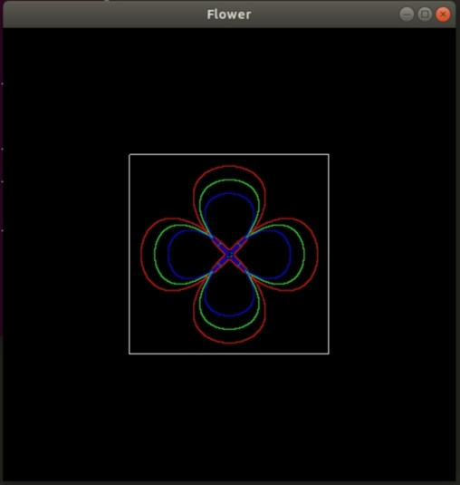

# Bezier-curves-graphics
Made a flower using Bezier curves in C++ using OpenGL.

## OpenGL (GLUT) on linux(ubuntu) 
 ### Installation 
* Install the following packages from the ubuntu repository: 
1. freeglut3-dev 
1. mesa-common-dev 

 ### Compiling and Linking 
1. You will have to use the -lglut linker option with gcc/g++ to compile a program with glut library. 
1. For example, to compile the program cube.c that uses GLUT type, use 
1. gcc -o cube cube.c -lglut -lGLU 
1. to get the binary executable cube. 

 If you are not using GLUT and want to use the lower level libraries then use -lGL -lGLU also in the linker options. 

 sudo apt-get install freeglut3 freeglut3-dev mesa-common-dev 

Check your /usr/include/GL folder to verify the installation of the openGL headers that you intend to use. 

## OpenGL (GLUT) on Windows
### Installation

1. opengl32.lib
1. glu32.lib
1. gl.h
1. glu.h

* These are usually provided by the manufacturer of your display adapter. The following files will also be needed for using GLUT

1. glut32.dll
1. glut32.lib
1. glut.h
1. Download GLUT. Unzip and copy glut32.dll to C:\Windows\system32 
* Note:The code given works in ubuntu.To run it in Windows, add a header file #include<windows.h>

## Steps to setup:

Clone the repository. git clone [https://github.com/ishukhanchi/Bezier-curves-graphics.git](https://github.com/ishukhanchi/Bezier-curves-graphics.git) 

   Open terminal and follow following commands:
   * Change directory to repository. cd Bezier-curves-graphics   
   * Type g++ bz1.cpp -lglut -lGLU -lGL
   * Type a./out
   * Press "i" key on the keyboard to initiate the making of petals.
   * The output image will be: 
   
